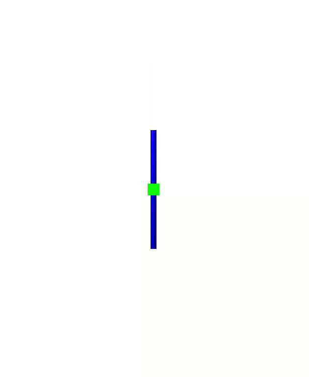

# Acrobot Swing up and balance control

## Overview

This project implements an Acrobot controller simulation that demonstrates various control strategies described in [this paper](https://courses.ece.ucsb.edu/ECE179/179D_S12Byl/hw/acrobot_swingup.pdf) on a two-link underactuated system (acrobot) using Drake. This work was done for ME5659 - Control Systems Engineering as a part of the final project. The project is described in detail in the report attached.



## Features

- **LQR Control:** 
- **Energy Shaping:** 
- **Partial Feedback Linearization:** 

## Requirements

- Python 3.x
- [NumPy](https://numpy.org/)
- [Matplotlib](https://matplotlib.org/)
- [pydrake](https://drake.mit.edu/pip.html) 

## Installation

1. **Clone the Repository**
2. **Install Drake**
   ```bash
   pip install drake
   ```
   For additional installation options and detailed instructions, see the [Drake installation guide](https://drake.mit.edu/pip.html).
3. **Run acrobot.ipynb**

